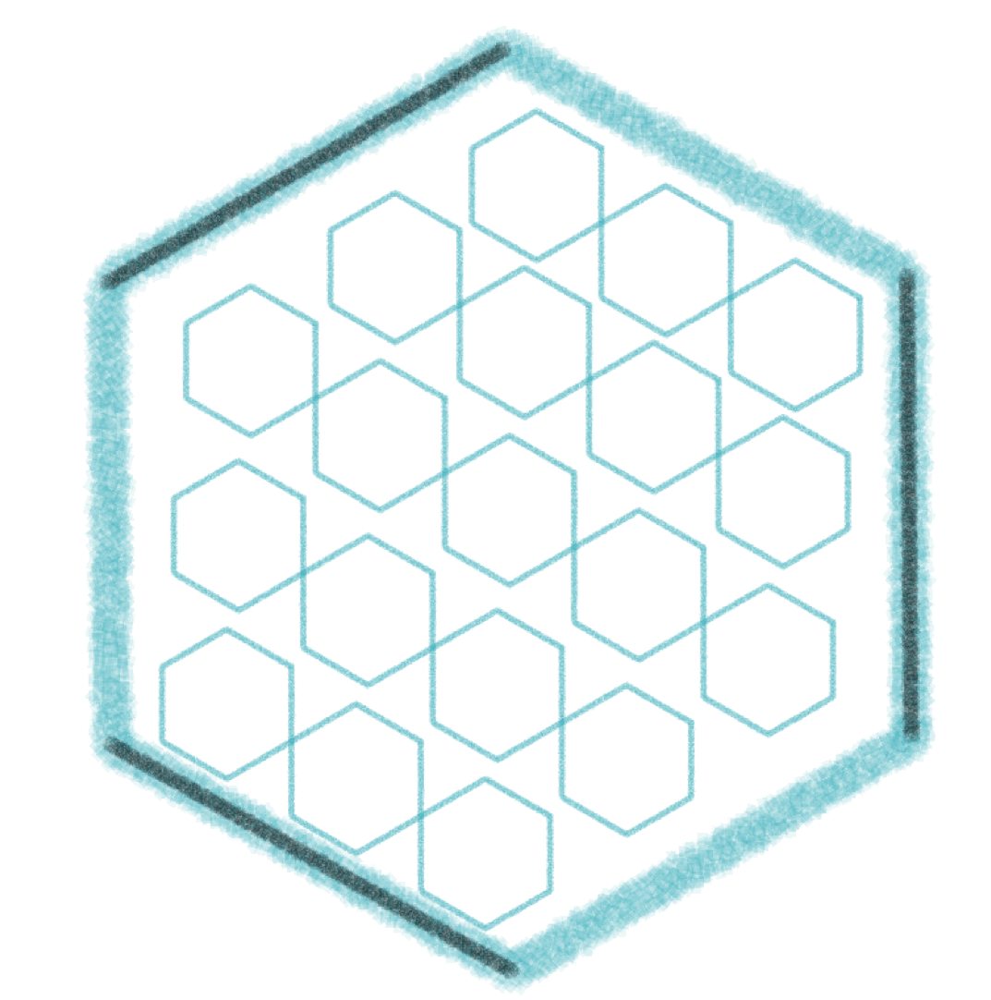

#  P2P-Social-Media-App

This is an on-going project to build a social media app using scalable concepts from modern social media application like twitter

* Micro-services to scale different functionalities
  * Uses Redis cache to update new posts for heavy read operations
  * Read server and Write server are scaled differently for Posts
* P2P app to control the cloud costs and create an ad-free application and privacy

# Technologies used
* Node.JS
* Angular
* MongoDB
* Redis
